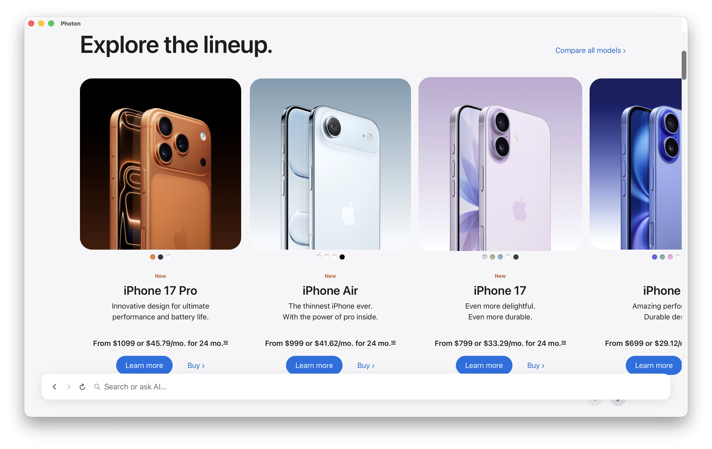
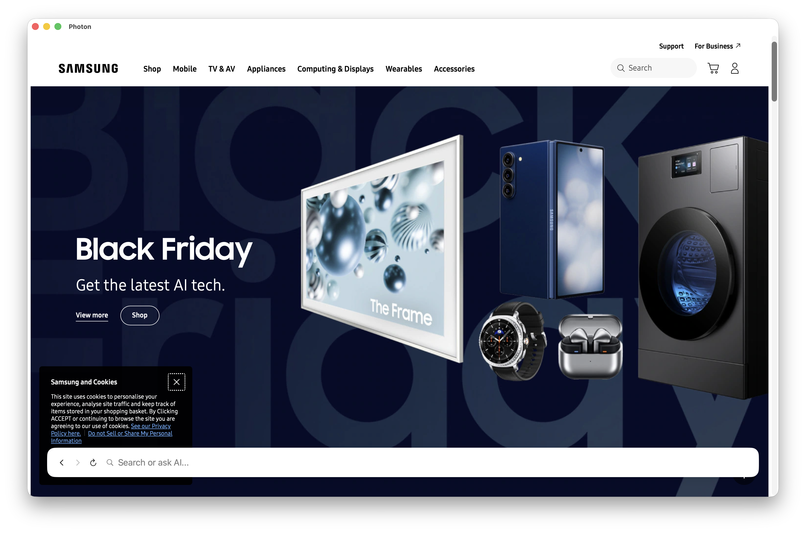

# Photon Browser

<div align="center">

**The Mac-Exclusive Browser That Gets Out of Your Way**

*Focus on your web content. The best interface is #NoInterface.*

</div>

---

## 🎯 **#NoInterface Philosophy**

**Photon is built on a radical idea: the browser should disappear.**

While other browsers compete for your attention with toolbars, buttons, and distractions, Photon fades into the background. Your search field intelligently hides when you're reading. Navigation controls appear only when needed. The interface adapts to you—not the other way around.

**The result?** Pure focus on what matters: your web content.

---

## ✨ **Why Photon?**

### **Mac-Native Excellence**
Built exclusively for macOS with SwiftUI and WebKit, Photon feels like it was always meant to be on your Mac. Native performance, native design language, native everything.

### **Intelligent Minimalism**
- **Dynamic Search Field**: Appears when you need it, disappears when you don't
- **Smart Positioning**: Choose top or bottom alignment—your way
- **Context-Aware UI**: The interface adapts to your workflow

### **AI That Doesn't Intrude**
Integrated AI support (MLX, Ollama, OpenAI, Mistral) that works in the background. Get answers without leaving your flow. Beautiful notification bubbles appear in the top-right corner—dismissible, expandable, and beautifully formatted with Markdown rendering. Real-time reasoning display shows AI thinking process.

### **Performance First**
- **Tab Freezing**: Inactive tabs stay frozen, preventing unnecessary reloads
- **WebKit Engine**: Lightning-fast rendering powered by Apple's WebKit
- **Native Swift**: Built from the ground up for macOS performance

---

## 🚀 **Get Started**

### **Quick Install**

1. **Download the latest release** from the [Releases](https://github.com/Caraveo/Photon/releases) page
2. **Extract** `Photon.app`
3. **Move to Applications** and launch

That's it. No complicated setup. No bloat. Just a browser.

### **If You See a Security Warning**

If macOS shows a "not free of malware" or "cannot be opened" warning:

1. Go to **System Settings** (or **System Preferences** on older macOS)
2. Navigate to **Privacy & Security** (or **Security & Privacy**)
3. Scroll down to find **Photon** in the list
4. Click **Open Anyway** or **Allow**

Alternatively, right-click `Photon.app` and select **Open** (first time only).

**Note**: This is normal for apps not distributed through the App Store. Photon is properly code-signed and safe to use.

### **From Source**

```bash
git clone https://github.com/caraveo/Photon.git
cd Photon
swift build -c release
```

---

## 🎨 **Screenshots**

<div align="center">


*Clean, focused, beautiful.*



*Your content, front and center.*



*The #NoInterface experience.*

</div>

---

## 🧠 **AI Integration (Optional)**

Photon includes powerful AI capabilities that stay out of your way:

- **Local AI**: Run MLX or Ollama on your machine—privacy-first
- **Cloud AI**: OpenAI and Mistral support for when you need more power
- **Beautiful Notifications**: AI responses appear as elegant, dismissible bubbles in the top-right corner
- **Markdown Rendering**: Responses are beautifully formatted with proper spacing, headings, lists, and code blocks
- **Real-Time Reasoning**: See AI thinking process for MLX models with reasoning sections
- **Expandable View**: Click any notification bubble to expand to full mode
- **Zero Friction**: AI works in the background, never interrupting your flow

**Setup**: `File → Settings` (or `CMD+,`) → Choose your AI provider → Connect

---

## ⌨️ **Keyboard Shortcuts**

- `CMD+T` / `CTRL+T` - New tab
- `CMD+,` - Settings
- `Enter` - Search/Navigate
- `ESC` - Dismiss AI cards

**That's it.** No overwhelming shortcuts. Just the essentials.

---

## 🛠️ **For Developers**

### **Tech Stack**
- **SwiftUI** - Modern, declarative UI framework
- **WebKit** - Apple's powerful web rendering engine
- **Swift Package Manager** - Clean dependency management

### **Code Signing**

Sign your build with your Apple Developer account:

```bash
./sign.sh
```

The script auto-detects your signing identity. 

**Note**: For public distribution, you need a "Developer ID Application" certificate (not just "Apple Development"). See [DISTRIBUTION.md](DISTRIBUTION.md) for details on obtaining and using Developer ID certificates.

### **Project Structure**

```
Photon/
├── Sources/
│   ├── PhotonApp.swift          # App entry point
│   ├── Models/                  # Data models
│   ├── Views/                   # SwiftUI views
│   ├── Services/                # AI & network services
│   └── Bridge/                  # METAL bridge for IPC
└── Package.swift
```

---

## 🎯 **The Photon Difference**

| Traditional Browsers | Photon |
|---------------------|--------|
| Cluttered toolbars | Clean, minimal |
| Always-visible UI | Context-aware |
| Distracting interface | #NoInterface |
| Generic design | Mac-native |
| One-size-fits-all | Adapts to you |

---

## 📋 **Requirements**

- **macOS 13.0+** (Ventura or later)
- **Apple Silicon or Intel Mac**
- **Optional**: Local AI services (MLX/Ollama) for privacy-first AI

---

## 🌟 **Features**

- ✅ **Native macOS Experience** - Built exclusively for Mac
- ✅ **Intelligent UI** - Interface that adapts to you
- ✅ **Tab Management** - Multiple tabs with keyboard shortcuts
- ✅ **AI Integration** - Optional, powerful, unobtrusive
  - Beautiful Markdown-formatted responses
  - Real-time reasoning display for MLX models
  - Dismissible notification bubbles
  - Expandable full-mode view
- ✅ **Smart Search Field** - Appears on activity, hides on fast scroll or idle
- ✅ **Performance Optimized** - Tab freezing, efficient rendering
- ✅ **Privacy-First** - Local AI options, no tracking
- ✅ **Open Source** - MIT License, fully transparent

---

## 🤝 **Contributing**

We welcome contributions! Whether it's bug fixes, features, or documentation improvements, your help makes Photon better.

1. Fork the repository
2. Create your feature branch
3. Make your changes
4. Submit a Pull Request

---

## 📄 **License**

MIT License - Use it, modify it, make it yours.

---

## 🎉 **Ready to Focus?**

**Download Photon today and experience browsing without the browser.**

<div align="center">

**[Download Latest Release](https://github.com/Caraveo/Photon/releases)** | **[View on GitHub](https://github.com/Caraveo/Photon)**

*The browser that gets out of your way.*

</div>

---

<div align="center">

**Made with ❤️ for Mac users who value focus over features.**

</div>
